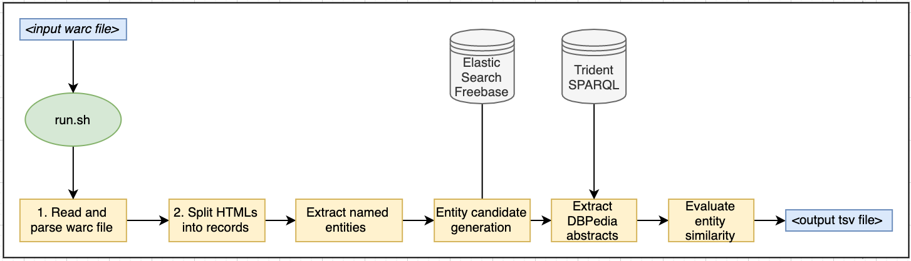

# Assignment: Large Scale Entity Linking - Group 7
- Shreyas Sivaramakrishnan
- Petar Galic
- Mostafa Doroodian
- Mansi Mundra

This repository is code for Web Data Processing Systems Assignement in Period 2, 2019.

- [Table of Contents](#heading)
  * [Code Implementation](#sub-heading-1)
    + [Design Overview](#sub-sub-heading-1)
    + [Implementation Details](#sub-sub-heading-3)
  * [Implementation on DAS](#sub-heading-2)
    + [Execution](#sub-sub-heading-4)
    + [Details about files](#sub-sub-heading5)
  * [Results and Conclusion](#sub-heading-3)
    + [Results](#sub-sub-heading-6)
    + [Discussion on Results](#sub-sub-heading-7)
    + [Conclusion](#sub-sub-heading-8)


### Code Implementation


#### Design Overview


#### Implementation Details
We wrote our code in python3, using `python/3.5.9` module in DAS.
We used many libraries already present in Python, but we had to use certain external python packages for nlp, distribution and other uses. These packages are:
1. `spacy` (along with its model `en_core_web_sm`)
 - We used `spaCy` as our nlp library because of its ease of use.
 - We use additional filtering to extract only named entities using spacy
 - Medium English Model has been used instead of larger alternative due to computational limits.  
2. `pyspark` (along with `findspark`), in order to distribute and process the data on top of hadoop cluster in DAS. 
 - `pyspark` development has been done in another branch in the same repo. Due to lack of computational resources(image in     data folder)
3. `beautifulsoup` for extracting raw data out of warc `html` payload
 - During text extraction, we ignore some HTML content which are not visible to the user such as metadata, etc.
4. `scikit-learn`, more precisely `TfidfVectorizer` class which is used for to calculate cosine similarity.

 When Trident was unavailable or taking extremely long times, we tested our queries from an open endpoint over the internet; code for the same can be found on sparqlSearcher.py.
 
 After extracting the visible text from the warc, we generate candidate entities of the top 5 results from the Freebase using ElasticSearch. Then we use sparql to query DBPedia for the abstracts for the results fetched in previous step, following which we calculate the cosine similarity of the abstracts with input HTML text, rank the entities and choose the best one for the output. 

### Implementation on DAS
#### Python virtual environment
We have installed all the necessary python packages inside a virtual env which was set up using `virtualenv`.
#### Spark setup
We have downloaded Spark version `2.4.4` from apache without Hadoop since the Hadoop cluster is already configured in DAS. In order for Spark to work we needed to add the Hadoop path in its configuration. We also had to configure the right python executable for `pyspark` to run.
#### Execution-
The following commands need to be run:

```

cd /home/wdps1907/assignment
pyenv activate wdps2
sh start_sparql_server.sh
# get node and port 
sh process.sh <input_warc_gz_file> <output_tsv_file> <sparql_server_hostname>:<sparql_server_port> <elasticsearch_hostname>:<elasticsearch_port>
# EXAMPLE: sh process.sh data/sample.warc.gz sample.predictions.tsv node:002:9090 node001:9200

# check output in the <output_tsv_file>

```
 

#### Details about files
The system is organized in following files:
- `warcRecord.py` : Contains `WarcRecord` object which is a representation of one `warc` record. It has attributes `id` and `payload`. This class has a method `parse` which parses the record, removes unnecessary headers and stores data in its `payload` and `id` attributes.
- `sparqlSearcher.py`: Contains `SparqlSearcher` object which is the point of interaction with trident database and its used for querying the trident database.
- `elasticSearcher.py`: Contains `ElasticSearcher` object which is used for querying the Freebase labels inside the Elastic Search.
- `starter-code.py`: Contains core functions of the system.

### Results and Conclusion
The results were calculated with 560 custom generated entities and 1085 linked entities.
#### Results

| Metric | Value |
| --- | --- |
| Correct Mappings| 55 |
| Precision | 0.0501 |
| Recall | 0.0982 |
| Accuracy | 0.3666 |

#### Discussion on results

The precision results are fairly low due to the fact that we use later model of the English named entities database which gives a lot of predictions. On adjusting the formula to calculate accuracy, the score improves.

